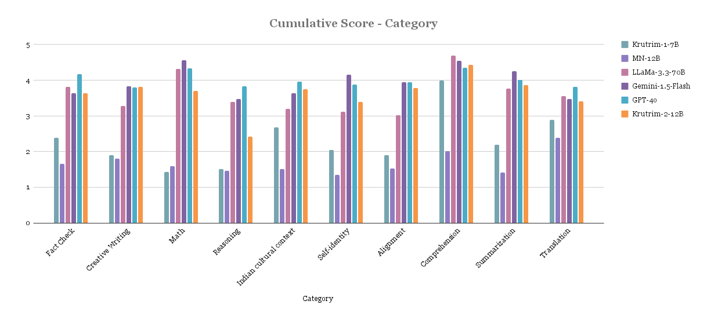
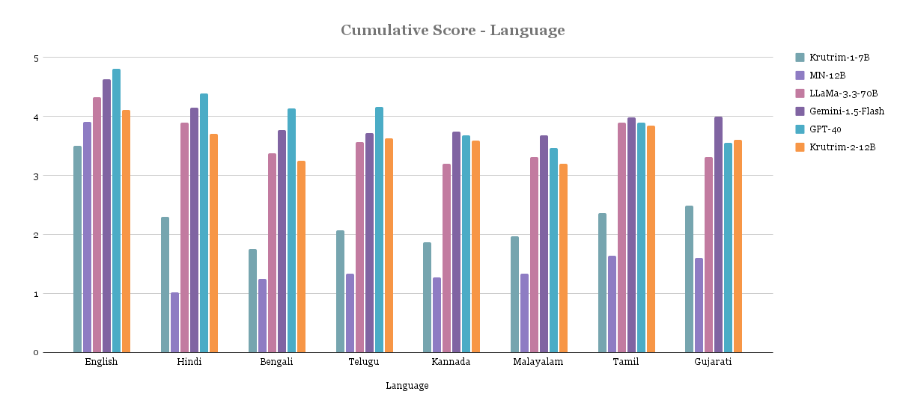

# Krutrim-2

## Model Overview
Krutrim-2 is a 12B parameter language model developed by the OLA Krutrim team. It is built on the Mistral-NeMo 12B architecture and trained across various domains, including web data, code, math, Indic languages, Indian context data, synthetic data, and books. Following pretraining, the model was finetuned on diverse data covering a wide range of tasks, including knowledge recall, math, reasoning, coding, safety, instruction following and creative writing.

After fine-tuning, the model underwent Direct Preference Optimization (DPO) to enhance alignment across multiple aspects. DPO was applied to improve response helpfulness, safety, and reasoning.

The model delivers best-in-class performance across Indic tasks and a promising performance on English benchmarks equivalent to models 5-10x the size. We present details of the model architecture, pre-training, post-training and evaluation results. We also publicly release the post-trained versions of the model. We are continuously improving the model through post-training techniques such as RLHF. 

[](https://www.youtube.com/watch?v=beqXNHq67xg)


## Key Features
- 12B parameter dense transformer model leading to better generalization compared to Krutrim-1 7B;
- Supports context up to 128K tokens making it suitable for long multi-turn conversations, long-form generations, document translations and others;
- Delivers competitive performance on most English benchmarks and HumanEval coding task;
- Natively multilingual delivering best-in-class performance on Indic benchmarks;
- Matches or exceeds performance of models much larger (x6) on multilingual Indic generation tasks including creative writing, summarization, and translation;
- Stronger Indian cultural context relevance - scored the highest in manual evaluation with multiple models in an anonymised setting;
- Delivers top-3 performance on 5 (out of 7) tasks in BharatBench among much larger open source and commercial models. 
- Available in instruction-tuned versions;

## Model Developer
- OLA Krutrim Team

## Model Dates
- Krutrim-2 was trained between Dec 2024 and Jan 2025.

## Release History

| Model Name | Release Date |Release Note | Reference|
|------------|-------------|-------------|-------------|
| Krutrim-2-Instruct  | 2024-01-31 | Trained with MN-12B architecture |
| Krutrim-2-Instruct  | 2024-01-31 | Finetuned and aligned version of Krutrim-2-Base |[Here](https://huggingface.co/krutrim-ai-labs/Krutrim-2-instruct)


## Data Freshness
- The dataset includes information up to April 2024.

## Model Architecture
- Layers: 40
- Hidden Dimension: 5,120
- Head Dimension: 128
- Hidden Dimension: 14,336
- Activation Function: SiLU
- Number of Heads: 32
- Number of KV-Heads: 8 (GQA)
- Rotary Embeddings: Theta = 1M
- Vocabulary Size: 131072 (2<sup>17</sup>)
- Architecture Type: Transformer Decoder (Auto-regressive Language Model)

## Evaluation Results

### English/Code/Math Benchmarks


| Benchmark                                 | Krutrim-1-7B | MN-12B-Instruct| Krutrim-2-12B | llama-3.3-70B       | Gemini-1.5 Flash       | GPT-4o                 |
|-------------------------------------------|--------------|----------------|--------------------|----------------------|------------------------|-----------------------|
| Hellaswag (0-shot) - Accuracy             | 0.74         | 0.82           | 0.83               | 0.95                 | 0.87 (10-shot)         | 0.95 (10-shot)        |
| Winogrande (0-shot) - Accuracy            | 0.67         | 0.74           | 0.77               | 0.85 (5-shot)        | -                      | 0.88 (5-shot)         |
| OpenBookQA (0-shot) - Accuracy            | 0.45         | 0.46           | 0.49               | -                    | -                      | -                     |
| CommonSenseQA (0-shot) - Accuracy         | 0.74         | 0.70           | 0.74               | -                    | -                      | 0.85                  |
| TruthfulQA (0-shot) - Accuracy            | 0.49         | 0.54           | 0.59               | -                    | -                      | 0.59                  |
| MMLU (5-shot) - Accuracy                  | 0.47         | 0.68           | 0.63               | 0.82                 | 0.79                   | 0.86                  |
| TriviaQA (5-shot) - EM                    | 0.44         | 0.72           | 0.62               | -                    | -                      | -                     |
| NaturalQuestions (5-shot) - EM            | 0.15         | 0.28           | 0.26               | -                    | -                      | -                     |
| GSM8K (0-shot) - EM                       | 0.07         | 0.74           | 0.71               | 0.93 (8-shot, CoT)   | 0.86 (11-shot)         | 0.89                  |
| ARC_Challenge (0-shot) - Accuracy         | 0.48         | 0.59           | 0.60               | 0.93 (25-shot)       | -                      | 0.50                  |
| ARC_Easy (0-shot) - Accuracy              | 0.73         | 0.80           | 0.82               | -                    | -                      | -                     |
| HumanEval - Pass@10                       | 0.00         | 0.23           | 0.80               | 0.88                 | 0.74 (0-shot)          | 0.90                  |
| IF_Eval (0-shot) - Accuracy               | 0.27         | 0.46           | 0.73               | 0.92                 | -                      | 0.84                  |

### Indic Benchmarks

| Benchmark                                  | Metric     | Krutrim-1-7B | MN-12B-Instruct | Krutrim-2-12B | llama-3.1-8B | llama-3.3-70B | Gemini-1.5 Flash | GPT-4o |
|--------------------------------------------|------------|--------------|----------------|--------------|--------------|--------------|----------------|--------|
| IndicSentiment (0-shot)                   | Accuracy   | 0.65         | 0.70           | 0.95         | 0.05         | 0.96         | 0.99           | 0.98   |
| IndicCOPA (0-shot)                        | Accuracy   | 0.51         | 0.58           | 0.80         | 0.48         | 0.83         | 0.88           | 0.91   |
| IndicXParaphrase (0-shot)                 | Accuracy   | 0.67         | 0.74           | 0.88         | 0.75         | 0.87         | 0.89           | TBD    |
| IndicXNLI (0-shot)                        | Accuracy   | 0.47         | 0.54           | 0.55         | 0.00         | TBD          | TBD            | TBD    |
| IndicQA (0-shot)                          | Bert Score | 0.90         | 0.90           | 0.91         | TBD          | TBD          | TBD            | TBD    |
| CrossSumIN (1-shot)                       | chrF++     | 0.04         | 0.17           | 0.21         | 0.21         | 0.26         | 0.24           | TBD    |
| FloresIN Translation xx-en (1-shot)       | chrF++     | 0.54         | 0.50           | 0.58         | 0.54         | 0.60         | 0.62           | 0.63   |
| FloresIN Translation en-xx (1-shot)       | chrF++     | 0.41         | 0.34           | 0.48         | 0.37         | 0.46         | 0.47           | 0.48   |
| IN22 Translation xx-en (0-shot)           | chrF++     | 0.50         | 0.48           | 0.57         | 0.49         | 0.58         | 0.55           | TBD    |
| IN22 Translation en-xx (0-shot)           | chrF++     | 0.36         | 0.33           | 0.45         | 0.32         | 0.42         | 0.44           | TBD    |


### BharatBench
The existing Indic benchmarks are not natively in Indian languages, rather, they are translations of existing En benchmarks. They do not sufficiently capture the linguistic nuances of Indian languages and aspects of Indian culture. Towards that Krutrim released BharatBench - a natively Indic benchmark that encompasses the linguistic and cultural diversity of the Indic region, ensuring that the evaluations are relevant and representative of real-world use cases in India.

| Benchmark                           | Metric      | Krutrim-1-7B | MN-12B-Instruct | Krutrim-2-12B | llama-3.1-8B-Instruct | llama-3.1-70B-Instruct | Gemma-2-9B-Instruct | Gemma-2-27B-Instruct | GPT-4o |
|-------------------------------------|------------|--------------|-----------------|---------------|------------------------|------------------------|---------------------|---------------------|--------|
| Indian Cultural Context (0-shot)    | Bert Score | 0.86         | 0.56            | 0.88          | 0.87                   | 0.88                   | 0.87                | 0.87                | 0.89   |
| Grammar Correction (5-shot)         | Bert Score | 0.96         | 0.94            | 0.98          | 0.95                   | 0.98                   | 0.96                | 0.96                | 0.97   |
| Multi Turn (0-shot)                 | Bert Score | 0.88         | 0.87            | 0.91          | 0.88                   | 0.90                   | 0.89                | 0.89                | 0.92   |
| Multi Turn Comprehension (0-shot)   | Bert Score | 0.90         | 0.89            | 0.92          | 0.92                   | 0.93                   | 0.91                | 0.91                | 0.94   |
| Multi Turn Translation (0-shot)     | Bert Score | 0.85         | 0.87            | 0.92          | 0.89                   | 0.91                   | 0.90                | 0.91                | 0.92   |
| Text Classification (5-shot)        | Accuracy   | 0.61         | 0.71            | 0.76          | 0.72                   | 0.88                   | 0.82                | 0.86                | 0.89   |
| Named Entity Recognition (5-shot)   | Accuracy   | 0.31         | 0.51            | 0.53          | 0.55                   | 0.61                   | 0.61                | 0.65                | 0.65   |
### Qualitative Results
Below are the results from manual evaluation of prompt-response pairs across languages and task categories. Scores are between 1-5 (higher the better). Model names were anonymised during the evaluation.




## Usage

To run this model, do this:
```
git clone https://github.com/ola-krutrim/Krutrim-2-12B.git
cd Krutrim-2-12B
pip install -r requirements.txt
```

To use the instruct model, you can load it with `AutoModelForCausalLM` as follows:

```python
from transformers import AutoModelForCausalLM, AutoTokenizer
import torch

model_id = "krutrim-ai-labs/Krutrim-2-instruct"

# Load model and tokenizer
model = AutoModelForCausalLM.from_pretrained(model_id)
tokenizer = AutoTokenizer.from_pretrained(model_id)
```

To generate, first format the prompt in OpenAI Chat Message Format and apply chat template. 
```python

prompt_dict = [
    {"role":'system','content':"You are an AI assistant."},
    {"role":'user','content':"Who are you?"}
]
prompt = tokenizer.apply_chat_template(prompt_dict, add_generation_prompt=True, tokenize=False)
inputs = tokenizer(prompt, return_tensors='pt')
inputs.pop("token_type_ids", None)

# Generate response
outputs = model.generate(
    **inputs,
    max_length=100
)

response = tokenizer.decode(outputs[0])
```

To test batch inference of instruct model, you can run
```
python inference/batch_inference.py
```

## Limitations
The model was trained on a dataset that includes content from the internet, which may contain toxic language, biases, and unsafe content. As a result, the model may:
- Amplify biases present in the training data
- Generate toxic responses, especially when prompted with toxic inputs
- Provide inaccurate, incomplete, or redundant answers
- Generate responses in languages inconsistent with the prompt

## License
[Krutrim Community License](./LICENSE)

## Ethical Considerations
- The model may produce biased or offensive outputs based on its training data.
- Users should apply human oversight when using the model for decision-making in sensitive areas.
- While safeguards have been implemented, the model may still generate socially undesirable text in certain contexts.

## Contact
TBD

